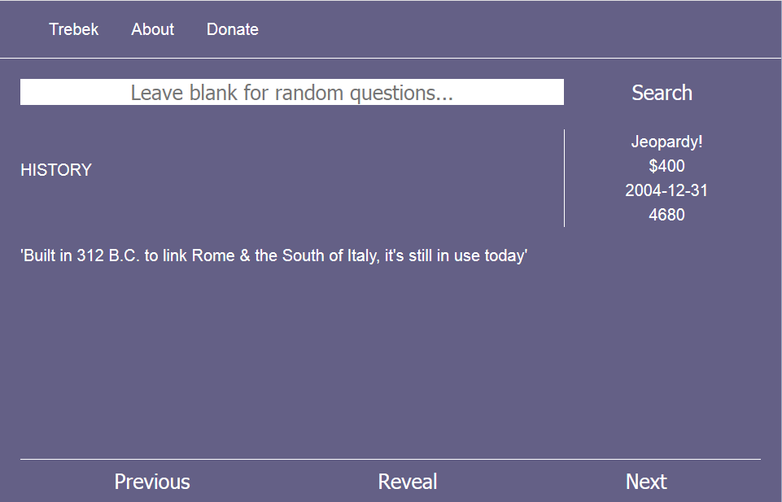

# Trebek

Trebek is a web application to help you study and hone your Jeopardy knowledge. A powerful search engine lets you test yourself against categories and relevant questions. Alternatively, if you leave the search field blank then Trebek will provide you with a random stream of questions.

Developed to get a better understanding of [ElasticSearch](https://github.com/elastic/elasticsearch) and [React](https://github.com/facebook/react) ([Reagent](https://github.com/reagent-project/reagent)), data was gathered from [J-Archive](http://j-archive.com/).
 
Currently, you will need to provide your own data. Do note that as long as your data is properly formatted, Trebek can be used as a quiz-like application for pretty much anything. The server should be robust enough to handle missing Jeopardy-data specific fields such as `show_number` and leave the corresponding field blank on the client.

There are a number of features that can be added to Trebek. Potential paths for additional development include:
 - User accounts
 - Score keeping
 - Analysis to help identify weak areas
 - Links to corresponding Wikipedia pages for answers
 - Shareable user-defined lists of questions
 - Keybindings to improve navigation
 - Social media links
 - Graph based exploration of data
 - Reporting buttons (e.g., incorrect answer, bug report)
 - Redesigned UI
 - Tagging of questions and answers by users
 - Dataset Store
 - Allow content to be submitted by users
 - Modify to accept user-provided data formats (i.e., data without misc fields like `show_number`)
 
 

## Prerequisites

You'll need the following installed in order to run Trebek:

- Clojure and Leinigen
- Elasticsearch 6.2.x
- elasticsearch-head (optional)
- npm

## Development

Configuration is stored in `env/dev/resources/config.edn` and `env/dev/prod/config.edn` for the respective profiles. These config files are tracked in source control... all sensitive config should be untracked and located elsewhere. See `yogthos/config` and `environ` for more information. With an uberjar, an additional config file can be passed in via something like the following snippet for the Java command: `-Dconfig="config.edn"`. This will merge and overwrite the default config values.

Finally, start the web application by running `lein figwheel` and `lein run` in two separate consoles. A certain profile can be selected like so for the dev profile `lein with-profile dev run`.

Standard Addresses:

- Website: `localhost:3000`
- Elasticsearch: `localhost:9200`
- Elasticsearch-head: `localhost:9100`

## ElasticSearch

First make sure elasticsearch (ES) is running, where ever and how ever they are located is up to you. If you were running one node on your local machine and not as a daemon, then something like `./elasticsearch-6.2.4/bin/elasticsearch` in the appropriate ES directory might suffice.

It would be prudent to feed ES your data at this point. See the section on Data Ingestion.

### ElasticSearch Head

> Note: ES Head appears to not work with ES 6 as of this writing

If you installed elasticsearch-head then the following commands are of use:

```
cd ../elasticsearch-head
npm install
npm run start
open http://localhost:9100/
```

> Note: You may need grunt-cli: `npm install -g grunt-cli` and you may have to disable CORS. See their github repo for additional information.

## Production

To run in production, you'll want to set up the ES nodes as necessary. At least two nodes in a cluster is advised... but I am not your mother so do what you want.

Provide a `config.edn` file in the Trebek project directory containing at least the following parameters for the Trebek server instance:

- `:es-url` - ES database url and port (e.g., http://localhost:9200)
- `:port` - Server port for Trebek

Run the following commands to build and launch Trebek.

```
lein uberjar
java -Dconfig="config.edn" -jar ./target/trebek.jar
```

### Heroku

To deploy to Heroku, via the Heroku CLI: `git push heroku master`

The ES url can be accessed via System variables with `env`. Don't commit this url... Bonsai ES HTTPS port is 443

## Data Ingestion

Here are some quick notes on feeding data via HTTP:

### Index

Create an index: `curl -XPUT 'localhost:9200/trivia?pretty'`

### Mapping

Data mapping for the Jeopardy dataset:

```
curl -XPUT 'localhost:9200/trivia/_mapping/jeopardy' -d '{
  "jeopardy" : {
    "properties" : {
	  "category": {
	    "type": "text"
	  },
	  "air_date": {
	    "type": "date",
		"format": "YYYY-MM-DD"
      },
	  "question": {
	    "type": "text"
	  },
	  "value": {
	    "type": "text"
      },
	  "answer": {
	    "type": "text"
      },
	  "round": {
	    "type": "text"
	  },
	  "show_number": {
	    "type": "text"
      }
    }
  }
}'
```

### Insert Data

Sample insert:

```
curl -XPOST 'localhost:9200/trivia/jeopardy/auto_id?pretty' -d '{
  "category": "HISTORY",
  "air_date": "2004-12-31",
  "question": "'For the last 8 years of his life, Galileo was under house arrest for espousing this man's theory'",
  "value": "$200",
  "answer": "Copernicus",
  "round": "Jeopardy!",
  "show_number": "4680"
}'
```

### Bulk Insert

To send a file to ES via Bulk API (as of ES 5.2.1):

```
curl -s -XPOST localhost:9200/trivia/jeopardy/_bulk --data-binary "@jeopardy_questions1_bulk_api.json"
```

### JQ

Chances are you'll need to modify your data to match the mapping above. [JQ](https://stedolan.github.io/jq/) is one handy JSON processor that can assist.

It was able to process 200k questions with ease during development.

## Assorted Trivia Sources
 
- https://www.reddit.com/r/datasets/comments/1uyd0t/200000_jeopardy_questions_in_a_json_file/ - values can be somewhat messy and inconsistently formatted
- https://www.reddit.com/r/trivia/comments/3wzpvt/free_database_of_50000_trivia_questions/ 
- https://www.reddit.com/r/datasets/comments/3j14vx/dataset_multiple_choice_trivia_questions_like/ 
- https://github.com/uberspot/OpenTriviaQA - weird formatting 
- http://opentdb.com/ - API based rather than whole dataset

